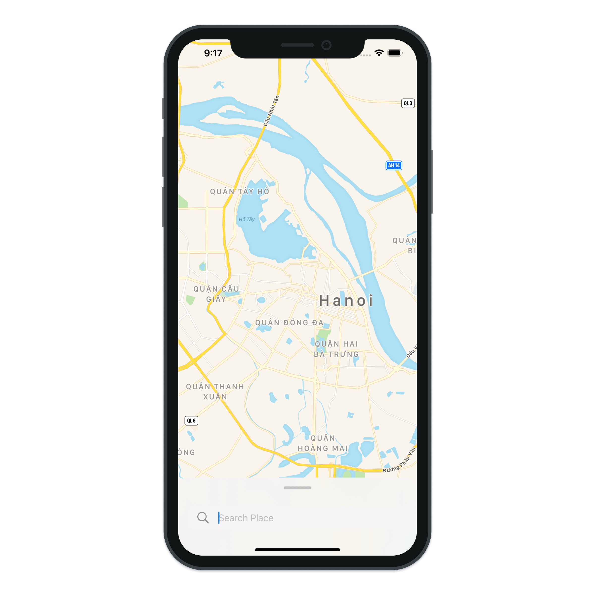
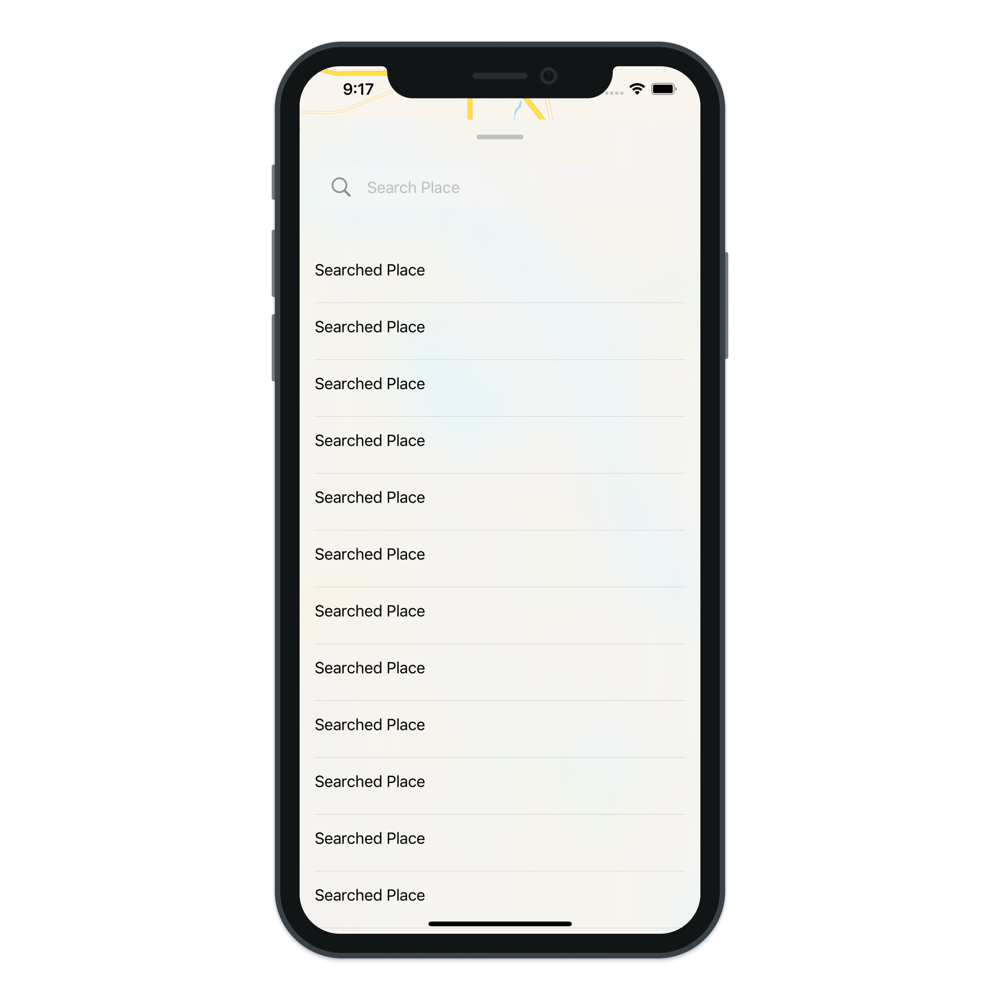

# Apple Map Bottom Sheet

> Build a simple Bottom Sheet and Apple Map with SwiftUI.

---

- SwiftUI MapKit
- SwiftUI VStack
- SwiftUI HStack
- SwiftUI Capsule
- SwiftUI Image
- SwiftUI TextField
- SwiftUI ScrollView
- SwiftUI LazyVStack
- SwiftUI UIBlurEffect
- SwiftUI UIVisualEffectView
