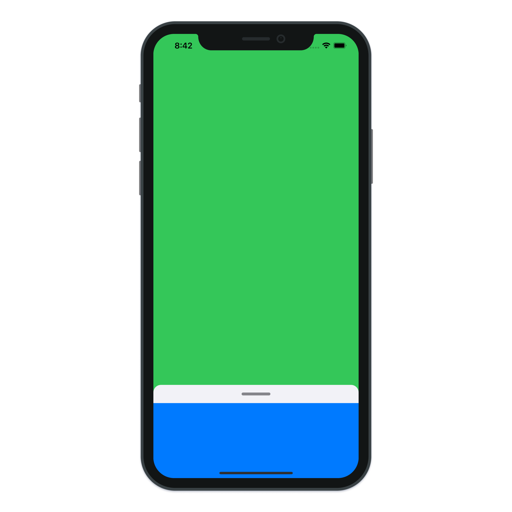

# Bottom Sheet

> Build a simple Bottom Sheet with SwiftUI.

---

- SwiftUI GeometryReader
- SwiftUI DragGesture
- SwiftUI RoundedRectangle
- SwiftUI VStack
- SwiftUI Interactive Animation

---

[Building Bottom sheet in SwiftUI](https://swiftwithmajid.com/2019/12/11/building-bottom-sheet-in-swiftui/)

[swiftui-drawer](https://github.com/maustinstar/swiftui-drawer)

[swiftui-bottom-sheet](https://github.com/weitieda/bottom-sheet)
