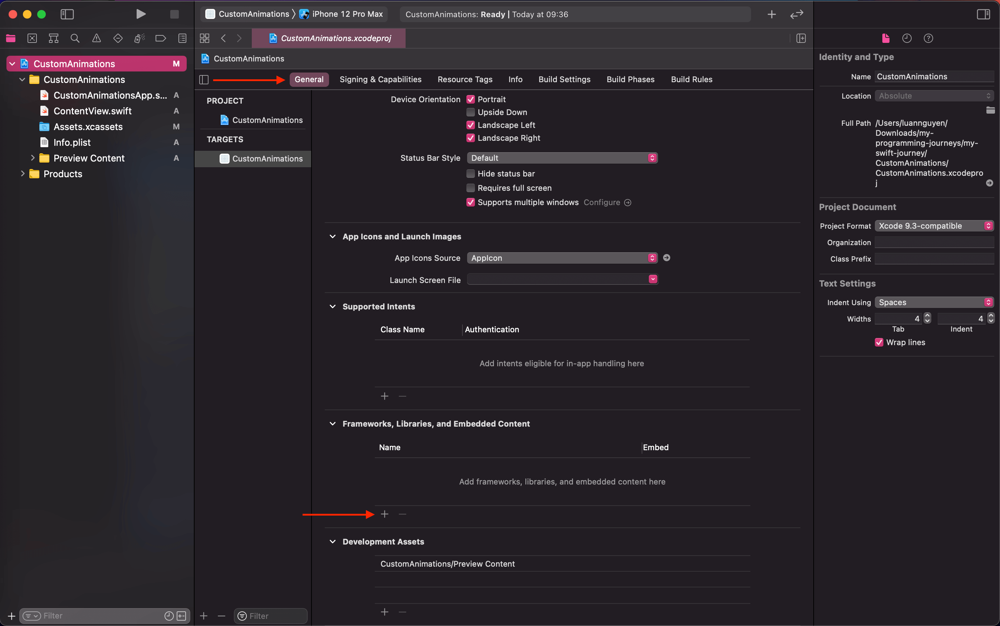

# Custom Animations

> Build a custom animations using Lottie iOS with SwiftUI.

---

[lottie-ios](https://github.com/airbnb/lottie-ios)

> An iOS library to natively render After Effects vector animations

---

[Custom Animations Demo on Streamable](https://streamable.com/efmpv0)
