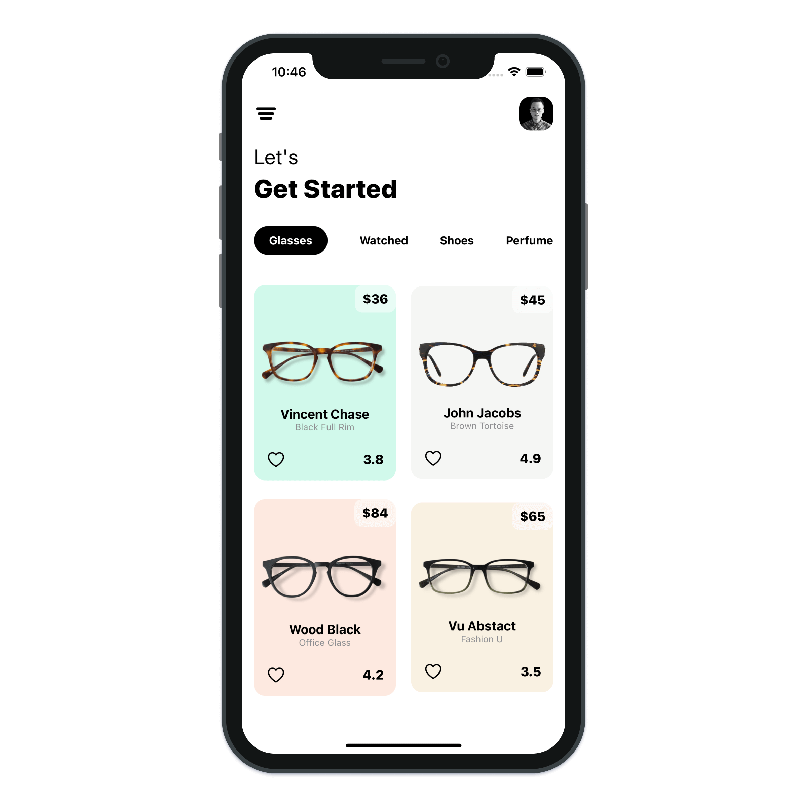
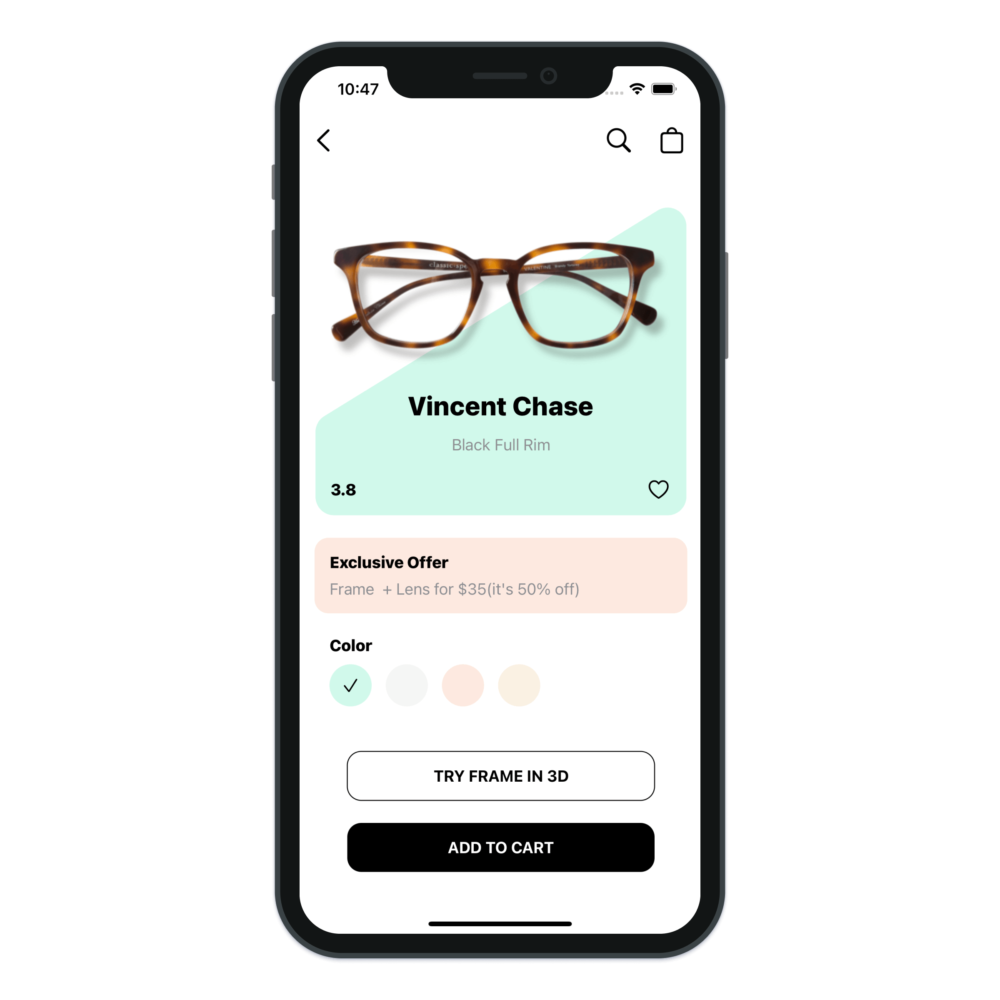

# Glassess App

> Build Glassess application with SwiftUI.

---

- SwiftUI 2.0 Animations
- SwiftUI 2.0 Hero Animations
- SwiftUI 2.0 Matched Geometry Effect
- SwiftUI 2.0 LazyGrids
- SwiftUI Complex Animations
- SwiftUI Custom Shapes
- SwiftUI Custom Segment Control
