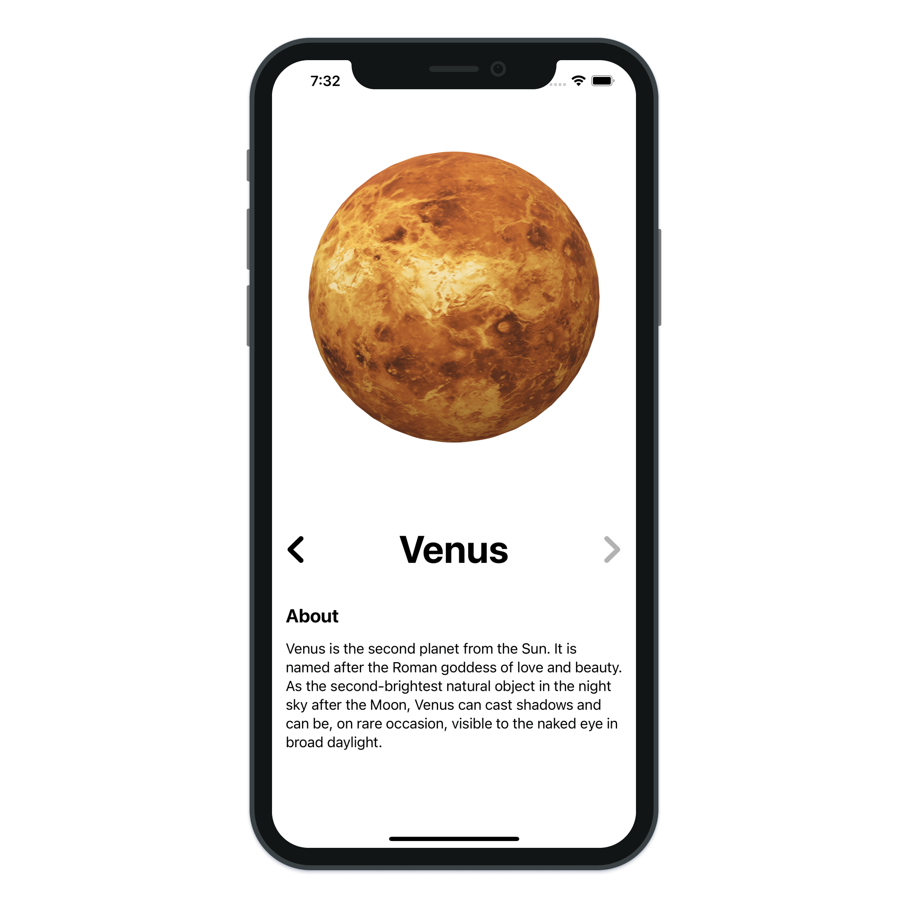
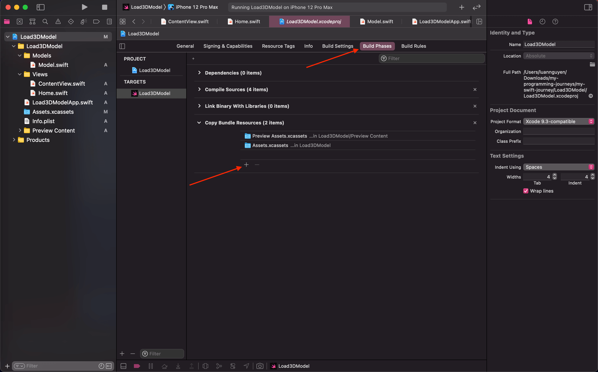
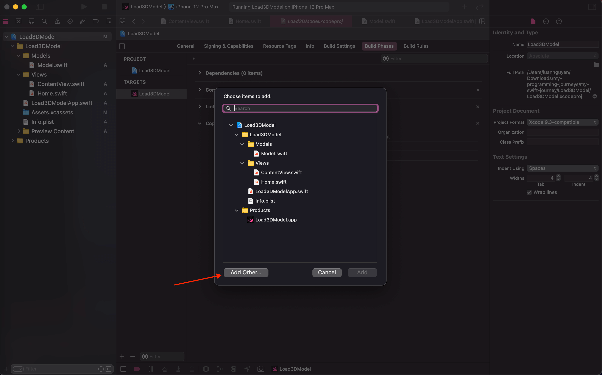
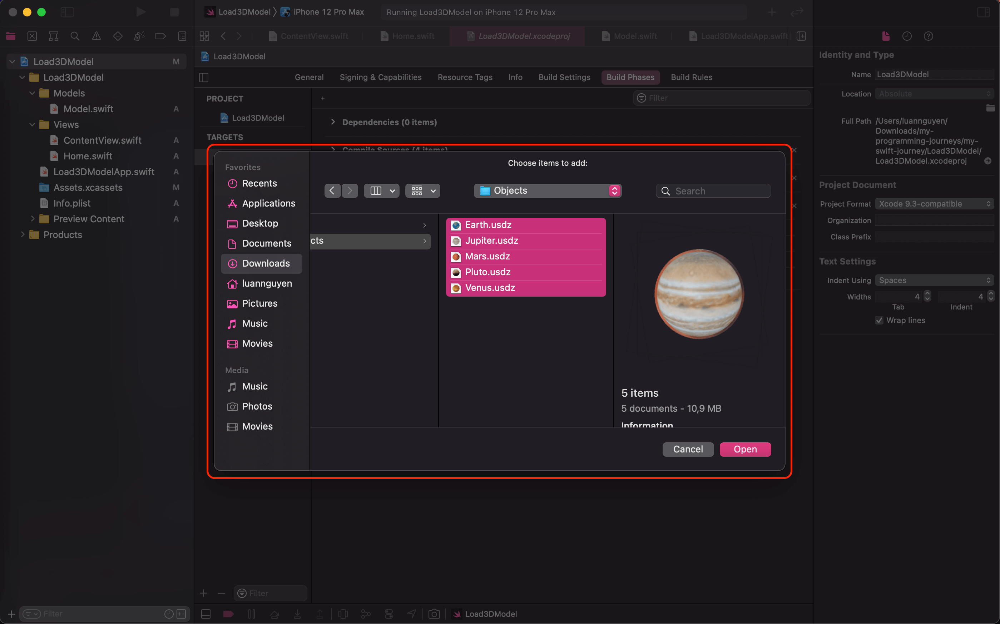
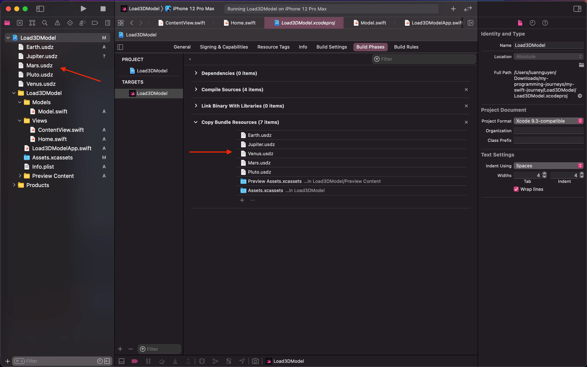
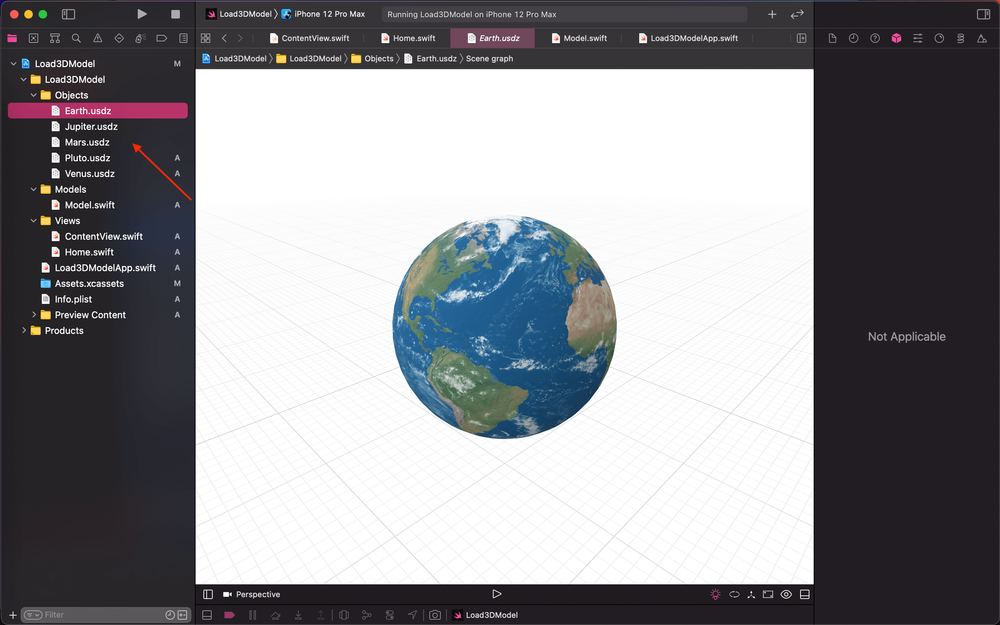

# Load 3D Model App

> Build Load 3D Model application with SwiftUI.

---

- SceneView using SwiftUI
- Loading 3D Models using SceneKit and SwiftUI
- SwiftUI SceneKit
- SwiftUI 2.0 SceneKit
- SwiftUI 3D Objects/Models
- SwiftUI SceneView
- SceneKit using SwiftUI
- Xcode 12 SwiftUI 2.0

---

## How to import 3D models

