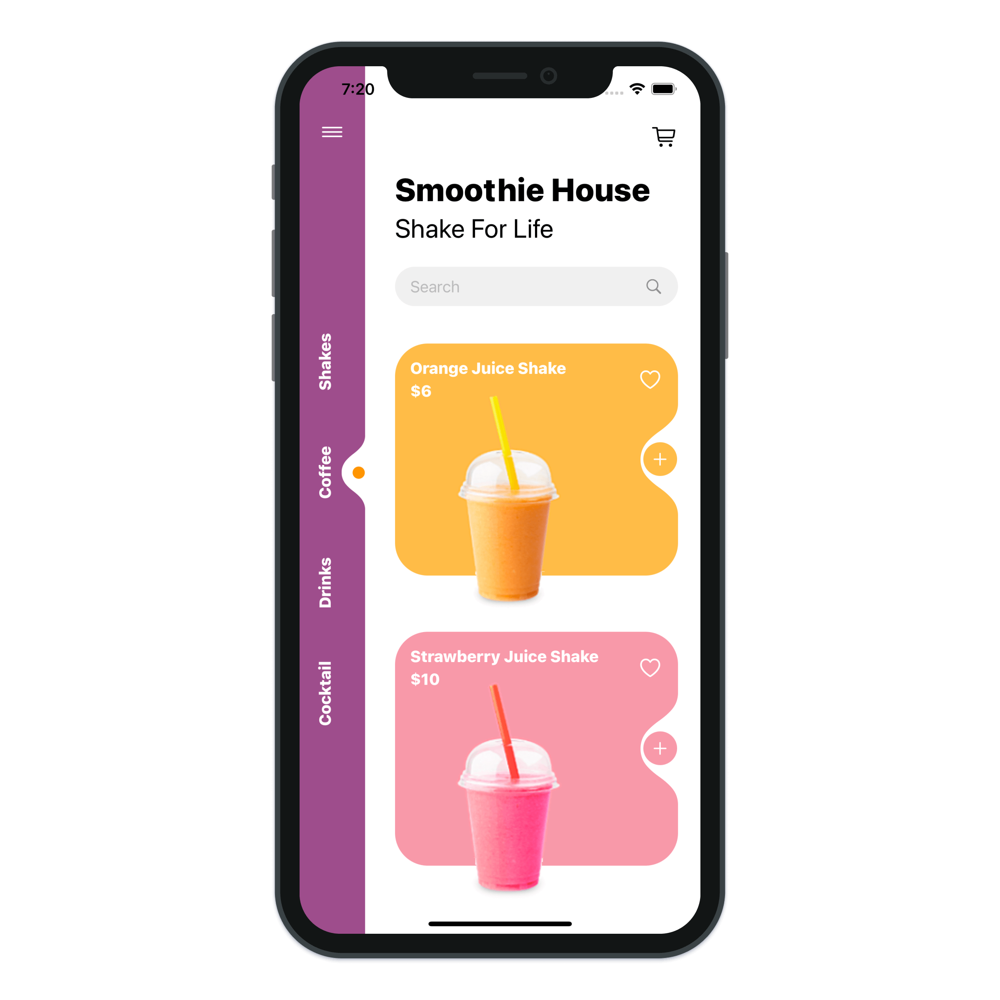
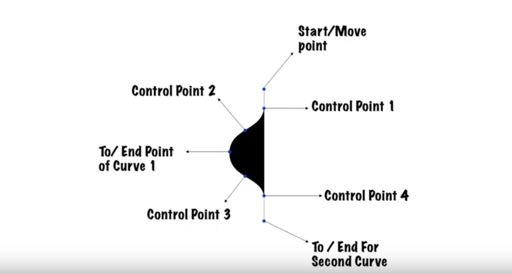

# Smoothie House

> Build Smoothie House application with SwiftUI.

---

- SwiftUI 2.0 Curved Side Tab Bar
- SwiftUI 2.0 Smooth Curves
- SwiftUI Curves
- SwiftUI Side Tab Bar
- SwiftUI Complex Animations
- SwiftUI 2.0 Custom Tab Bar
- SwiftUI 2.0 Custom Animations

---

## How To Draw Smooth Curve

---

[SwiftUI Complex UI - Food App UI - Side Tab Bar - Complex Smooth Curves - SwiftUI 2.0 Tutorials by Kavsoft](https://www.youtube.com/watch?v=ZJrKj-HW6ss)
